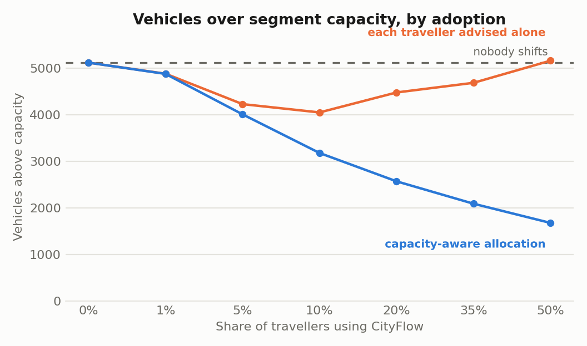
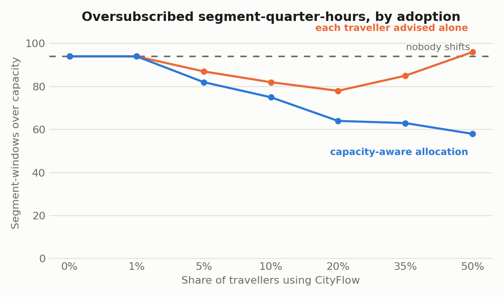
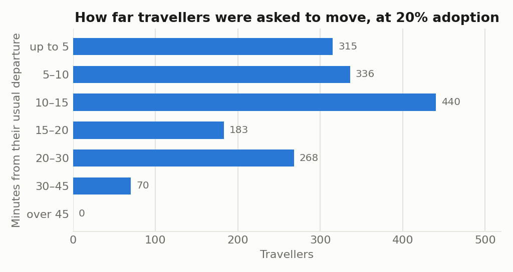
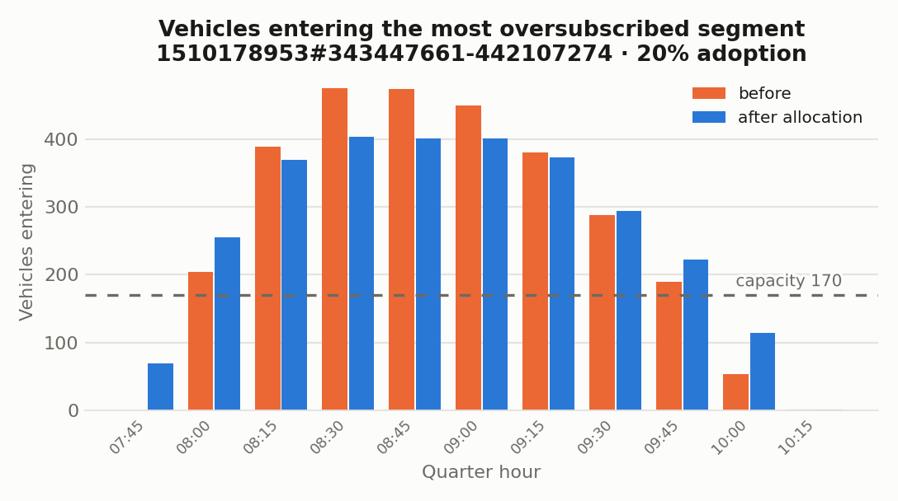

# CityFlow AI

A road segment jams when more vehicles enter it in a quarter of an hour than it can
discharge. Navigation apps route around a jam that already exists. CityFlow AI works one
step earlier: it moves *when* people leave, so inflow stays under capacity and the jam
does not form.

## The result



Bengaluru, 08:00–10:00, 61,866 commuters routed over the real OpenStreetMap network
(126,408 directed segments). Segment capacity comes from the Indo-HCM saturation-flow
model; the fleet is Indian-urban, 60% two-wheelers. The busiest segment in the cohort
runs at **2.8× its capacity** at peak.

At 20% adoption:

|                             | oversubscribed segment-quarter-hours | vehicles over capacity |
| --------------------------- | ------------------------------------ | ---------------------- |
| nobody shifts               | 94                                   | 5,115                  |
| **capacity-aware plan**     | **64**                               | **2,571** (−49.7%)     |
| independent per-user advice | 78                                   | 4,476 (−12.5%)         |

Coordination moved 1,612 travellers, a median of 15 minutes. The naive design moved 897
and removed a quarter as much. Per traveller actually inconvenienced, coordination clears
1.58 vehicles of excess against 0.71 — **2.2× more benefit per morning disrupted**.

Only 9,208 of the 61,866 journeys were movable at all. The other 85% are non-adopters and
people with no slack; the allocator plans *around* them rather than assuming them away.

## Coordination is the mechanism, not the advice



The orange line is what happens when every traveller is told their own best departure
time — the advice a navigation app can already give. It helps while few people follow it
and then turns on itself: each traveller is routed into the same trough, which becomes the
new peak. At 50% adoption it leaves the network **0.8% worse than telling nobody
anything**.

The blue line is the same travellers with the same flexibility, placed against a shared
ledger of what each segment has already been promised. Nothing about the traveller
changed. Only the allocator knowing what it had already said to everybody else.

This is the entire argument for the project: the useful object is not a prediction of the
best time to leave, it is a plan that stays feasible once acted upon.

## What it costs a traveller



Two thirds of the shifts are 15 minutes or less. The empty last bucket is not a finding:
declared flexibility in the demand model tops out at 45 minutes, and the allocator never
exceeds what a traveller declared. What the shape shows is that it rarely needs to go near
that ceiling. Placement order is by regret — the gap between a traveller's best and
second-best slot — so someone with one workable option is served before someone who is
nearly indifferent.



## Repository

| Path                | What it is                                                             |
| ------------------- | ---------------------------------------------------------------------- |
| `apps/traveller`    | Public app: City ID sign-in, journey routines, road-defect reporting    |
| `apps/municipal`    | Internal dashboard: defect triage, priority queue, crew assignment      |
| `services/engine`   | Capacity model, departure-slot allocator, SUMO scenarios, FastAPI       |
| `packages/ui`       | Shared React components                                                 |
| `packages/secrets`  | scrypt hashing, shared by both apps and the engine                      |
| `infra`             | Postgres+PostGIS compose file, migrations, OSRM, demo seed              |
| `docs`              | Design notes and measured results                                       |

Two Next.js apps, deployed separately, over one Postgres+PostGIS database. Maps are
MapLibre GL over free vector tiles. No Google Maps.

## Running it

Needs Node 22+, pnpm 9, Python 3.12 and Docker.

```sh
git clone https://github.com/shreyagoyal9/cityflow-ai.git
cd cityflow-ai
cp .env.example .env             # AUTH_SECRET: openssl rand -base64 48
pnpm install

docker compose -f infra/docker-compose.yml up -d postgres
set -a; . ./.env; set +a         # DATABASE_URL, for the seed script
python infra/seed_demo.py        # staff, wards and 180 defects for the dashboard

pnpm dev                         # traveller :3000, municipal :3001
```

The compose file applies `infra/migrations` on first start. `seed_demo.py` prints the
sign-in the dashboard needs.

## Reproducing the result

The engine's extras are separate because the web service never needs SUMO.

```sh
cd services/engine
pip install -e ".[sim,dev]"

python scripts/load_network.py   --city BLR      # OSM to PostGIS, once
python scripts/build_scenario.py --city BLR      # PostGIS to a SUMO network
python scripts/build_demand.py   --city BLR      # gravity model to a population
python scripts/run_baseline.py   --city BLR      # route it, and check the run is valid
python scripts/run_sweep.py      --city BLR --demand-share 1.0
python scripts/plot_results.py   --city BLR
```

`run_sweep.py` writes `docs/results/sweep-blr.json`; every number above is read from that
file and the charts are generated from it. Nothing in this repository restates a result by
hand.

## What this is not

**The excess figures are vehicles over modelled capacity, not minutes of delay.** Removing
half the over-capacity vehicles is not a claim that anyone's journey got half as long, and
the two are not proportional. A figure in minutes needs the allocated departures simulated
against the baseline in SUMO, which `run_allocation.py` writes the scenario for but which
has not been run.

**The demand is synthetic.** Origins and destinations come from a gravity model over OSM
building density and named employment districts, not from observed travel surveys. The
network, the routing and the capacity model are real; who wants to go where is a guess
with a defensible shape.

**The allocator is not wired into the traveller app yet.** It runs offline against a
scenario. The Today screen collects routines; it does not yet serve a plan from them.
`services/engine` currently exposes a health endpoint and nothing else.

**Path offsets assume free-flow speeds**, so the allocator's view of when a trip reaches
the far end of its route is optimistic under load. It errs in a known direction; fixing it
needs measured per-interval edge speeds from the baseline run.

Origin and destination are stored as ~600 m geohash cells, computed in the browser. Exact
addresses never leave the device. This is data minimisation, not end-to-end encryption —
see [docs/privacy.md](docs/privacy.md).

## Docs

- [docs/engine.md](docs/engine.md) — capacity, demand, the allocator, and the two ways a
  simulation run turned out to be invalid
- [docs/architecture.md](docs/architecture.md) — why two apps over one database
- [docs/data-model.md](docs/data-model.md) — schema and the privacy constraints in it
- [docs/privacy.md](docs/privacy.md) — what is stored, at what precision, and why
