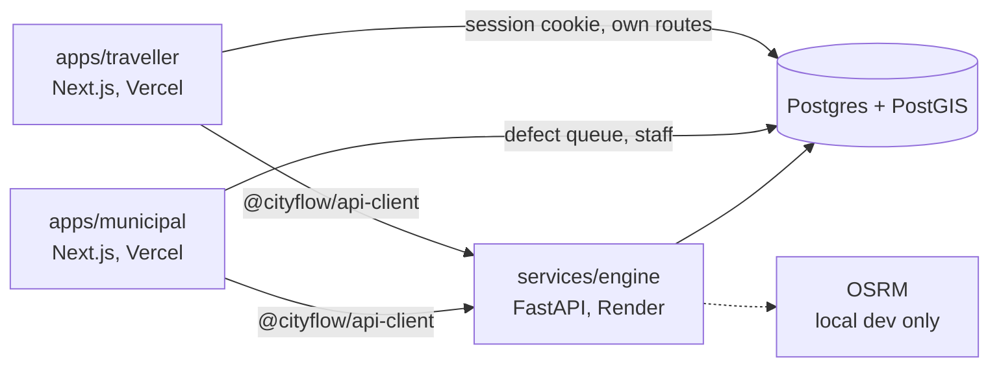

# Architecture

One repository, three deployable units, one database.

## Why it is split this way

**Two Next apps, not one app with two sections.** They are separate Vercel projects
with separate root directories, so the municipal dashboard has no route, no bundle and
no environment variable in common with the public site. A path-based split would leave
the two one middleware bug apart; this way a traveller request cannot reach municipal
code because the code is not deployed on that domain.

**A Python service, not a Next API route.** The capacity model, the slot allocator and
the travel-time model are numerical work that belongs in Python, and none of it fits
Vercel's serverless runtime. Keeping it separate also means the evaluation scripts and
the web application call exactly the same code.

**The apps talk to Postgres directly for their own data.** Reading a traveller's own
routines through an HTTP hop to Python would add latency and a second place for
authorisation to be wrong. The engine owns allocation; the apps own their own rows.

## Request flow: a departure recommendation

1. The browser resolves the typed address to a six-character geohash cell. The
   coordinate does not leave the device.
2. `POST /api/trips` on the traveller app writes a `trips` row — cells, arrival
   window, mode — scoped to the identity in the signed session cookie.
3. The engine's allocator runs over the batch of trips for the horizon, not one trip
   at a time, and writes `departure_slots` and one `recommendations` row per trip.
4. The app reads the recommendation back and shows it beside the counterfactual: the
   time the traveller would have left, and where that would have got them.

Steps 3 and 4 are Phase 2 work. Steps 1 and 2 are what Phase 1 built the schema for.

## Packages

- `packages/ui` — the layout shell both apps render inside. Consumed as TypeScript
  source and transpiled by each app, so there is no build step to keep in sync.
- `packages/api-client` — the typed client for the engine. It fails closed: a timeout
  or a non-200 becomes `EngineUnavailableError`, and both apps degrade to showing the
  engine as unreachable rather than failing the render.

## What runs where

|                    | Local                                           | Deployed                                       |
| ------------------ | ----------------------------------------------- | ---------------------------------------------- |
| `apps/traveller`   | `pnpm dev`, port 3000                           | Vercel, root directory `apps/traveller`        |
| `apps/municipal`   | `pnpm dev`, port 3001                           | Vercel, root directory `apps/municipal`        |
| `services/engine`  | `uvicorn app.main:app`                          | Render free tier                               |
| Postgres + PostGIS | `docker compose -f infra/docker-compose.yml up` | Supabase or Neon                               |
| OSRM               | docker compose, `routing` profile               | not deployed; travel times come from the model |

The engine's free tier sleeps when idle, so `@cityflow/api-client` allows eight seconds
for a cold start before giving up.

## What the browser will not do

Defect detection runs in a web page, not a native app, and that sets hard limits worth
stating before someone measures against expectations the platform cannot meet.

**iOS Safari requires an explicit grant.** `DeviceMotionEvent.requestPermission()` must
be called from inside a user gesture handler, and there is no way to ask again silently
if it is declined. Other browsers expose no such method, so the code feature-detects it
rather than sniffing the platform.

**Sampling is throttled, and not to a number the page chooses.** `devicemotion` is
delivered well below the 50 Hz a dedicated sensor app can request — in practice around
30 Hz on iOS — and is throttled further when the screen is off or the tab is in the
background. Windows are therefore defined by duration rather than by a sample count, and
the count a window actually received is recorded with its features so a low-rate
recording can be told apart from a quiet road later.

**Capture cannot leave the main thread.** `devicemotion` is a window event, so no worker
can subscribe to it. The analysis could be moved to one, but it is a few hundred
floating-point operations twice a second and moving it would mean copying every sample
across a `postMessage` boundary for no gain. The main thread does both.

**Accuracy depends on things the page cannot see.** A phone loose in a pocket measures
the person; a phone in a windscreen cradle measures the vehicle's suspension; a scooter
and a bus on the same road do not record the same thing. There is no calibration step
and no attempt to infer the mount. This is the largest source of error in the severity
figure, and the reason a defect needs several independent travellers before it is
believed.

**Position comes from a separate sensor with its own lag.** A jolt is placed at the
nearest position fix in time, and one more than five seconds from any fix is discarded
rather than guessed at: a defect report a crew cannot find is worse than no report.
